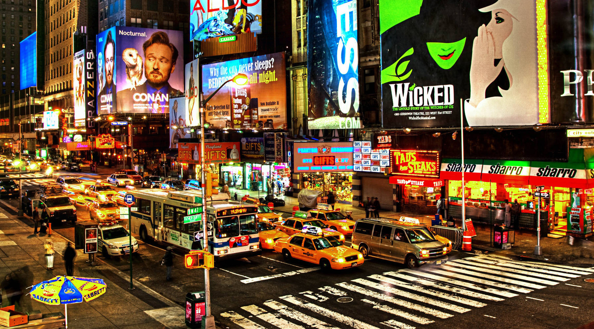

# Steganography
Python steganography tool: Hide an image inside another

## Steganography using Color Quantization (Indexed Color) and XOR-ing

To hide any size of image, this project performs steganography in the following steps:
1. Reduce the palette size of the input image
2. Map each color from the reduced palette to black, almost black colors (#000000, #000100, etc.)
3. Do (color-quantized and mapped image) XOR (cover image), pixel by pixel

## Usage

### Encoding
```
Usage:
  python steg.py -i <image_to_hide> -t <cover_image> -s <0|1>

Options:
  -i, --input              path to the image to hide
  -t, --target             path to the cover image
  -s, --save               1 to append the original cover image to the result, otherwise, 0

Example:
  $ python src/steg.py -i storage/data/image2.jpg -t storage/data/image1.jpg -s 1
```

Original Cover Image:


Encoded Cover Image:



Note: If the cover image is in JPEG format, the result image will be saved in WEBP.

### Decoding
```
Usage:
  python unsteg.py -i <image_to_hide> -t <cover_image> -s <0|1>

Options:
  -i, --input              optional, path to the original cover image
  -t, --target             path to the image containing a hidden image

Example:
  $ python src/unsteg.py -t storage/data/image1_.webp
```

Original Hidden Image:


Decoded Hidden Image:


## Building
This project is using Flet framework for GUI interface.

To build GUI standalone app, first install Flet using:
```
pip install flet[all]
```

Then, build the app:
```
flet pack src/main.py
```
